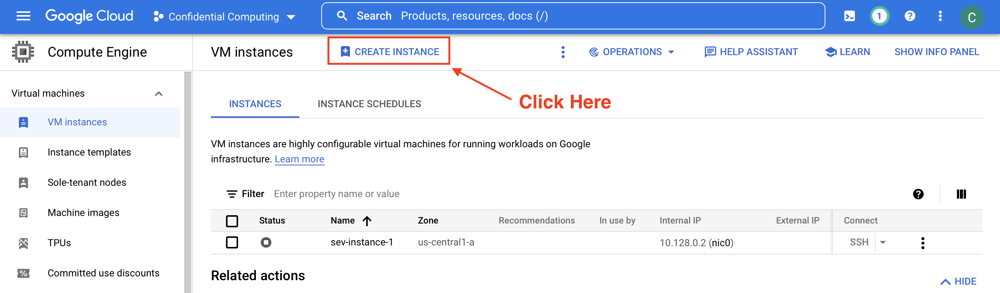
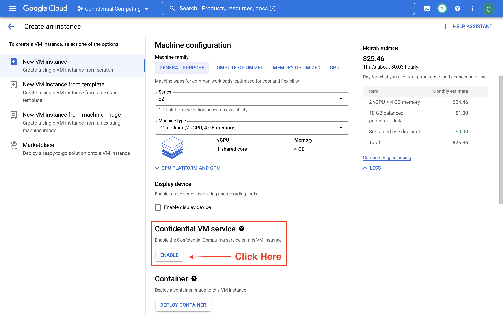
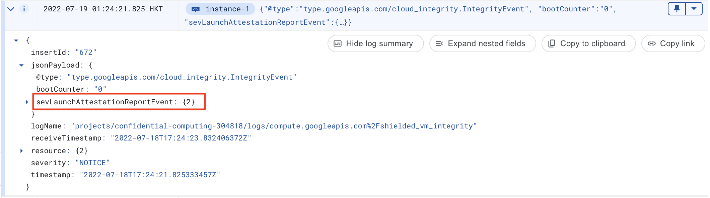

# tcwasm

In this repository, we show how to set up and run tcwasm in TEE. More specifically, we will set up a Google Confidential Computing VM instance, deploy TCWasm analyzer, and run some example test cases. If you are not familiar with TEE or Google Confidential Computing service, please refer to [Confidential Computing  |  Google Cloud](https://cloud.google.com/confidential-computing) for more information.

### Quick Start

##### Step 1: Set Up Confidential Computing Instance

*Before we start, please make sure that you already have an Google account, set up a Google Cloud project, enable billing for your project, and have Compute Engine API enabled. If that's not the case, or if you are not sure, please refer to [Create a Confidential VM instance in the Cloud console | Google Cloud](https://cloud.google.com/compute/confidential-vm/docs/create-confidential-vm-instance) for more information.*

To set up a confidential computing instance, just follow the typical process of creating new VM instances in Google Compute Engine Console. More specifically, visit Google Cloud Console ([https://console.cloud.google.com](https://console.cloud.google.com)), select `Compute Engine` in the product navigation menu, choose `VM instances` page, and then click `CREATE INSTANCE` button at the top of the page.



In the following `Create an instance` page, we then click button to `ENABLE` Confidential VM service. Please note that by enabling Confidential VM service, the system will automatically change some of our VM settings, e.g., `Machine type` and `Boot disk image`. Just leave these settings as default, and click `CREATE` at the bottom of page to start creating Confidential VM instance. Wait for this process to finish, it may take several minutes.



To validate if Confidential Computing service is enabled for our newly created VM, click instance name (e.g., "instance-1") to see VM instances `DETAILS`, then click `Cloud Logging` to see VM logs. In the logging results panel, find and check `sevLaunchAttestationReportEvent` for integrity report. If that's the case, we can be sure that our VM instance is indeed protected by Confidential Computing service.



For more information, please refer to [Validating instances using Cloud Monitoring | Confidential VM | Google Cloud](https://cloud.google.com/compute/confidential-vm/docs/monitoring).

##### Step 2: Install TCWasm Analyzer

*Before we start, please make sure that you have followed Step 1 in setting up  a Confidential Computing VM instance, and that you can SSH into the instance. If either is not for you, please refer to [Create a Confidential VM instance in the Cloud console | Google Cloud](https://cloud.google.com/compute/confidential-vm/docs/create-confidential-vm-instance) and [About SSH connections | Compute Engine Documentation | Google Cloud](https://cloud.google.com/compute/docs/instances/ssh) for more information.*

Now we have set up a Confidential Computing VM instance, it's time to install and test TCWasm. The simplest way to try this is by leveraging our prebuilt Docker image ([https://hub.docker.com/r/dockeryangzq12/tcwasm](https://hub.docker.com/r/dockeryangzq12/tcwasm)).

To run Docker image, we first need to set up a Docker Engine envrionment in the VM. The following commands assumes an Ubuntu 18.04 bionic OS envrionment, if your Confidential Computing VM instance is created with another OS version, please refer to  [Install Docker Engine | Docker Documentation](https://docs.docker.com/engine/install/) for more information.

```bash
# The following scripts assumes an Ubuntu 18.04 bionic operating system,
# and requires a stable SSH connection to the Confidential Computing VM,
# if that is not the case, refer to "https://cloud.google.com/compute/docs/
# instances/connecting-to-instance" for more information.

# (1) Set up apt package repository
$ sudo apt-get update
$ sudo apt-get install \
    ca-certificates \
    curl \
    gnupg \
    lsb-release
$ sudo mkdir -p /etc/apt/keyrings
$ curl -fsSL https://download.docker.com/linux/ubuntu/gpg | sudo gpg --dearmor -o /etc/apt/keyrings/docker.gpg
$ echo \
  "deb [arch=$(dpkg --print-architecture) signed-by=/etc/apt/keyrings/docker.gpg] https://download.docker.com/linux/ubuntu \
  $(lsb_release -cs) stable" | sudo tee /etc/apt/sources.list.d/docker.list > /dev/null

# (2) Install docker engine from repository
$ sudo apt-get update
$ sudo apt-get install docker-ce docker-ce-cli containerd.io docker-compose-plugin
```

If there are any problem with Docker Engine installation, please refer to [Install Docker Engine on Ubuntu | Docker Documentation](https://docs.docker.com/engine/install/ubuntu/).

Then, pull TCWasm Docker image, test to see if installation succeeds (you can check by comparing version output as here):

```bash
# The following scripts assumes an Ubuntu 18.04 bionic operating system,
# and requires a stable SSH connection to the Confidential Computing VM,
# if that is not the case, refer to "https://cloud.google.com/compute/docs/
# instances/connecting-to-instance" for more information.

# (1) Pull TCWasm image from Docker Hub
$ sudo docker pull dockeryangzq12/tcwasm:latest

# (2) Test if installation succeeds
$ sudo docker run -it dockeryangzq12/tcwasm:latest -v
seraph 1.0.0 # TCWasm version output
```

##### Step 3: Try with Simple Test Case

*Before we start, please make sure that you have followed Step 2 in installing and testing TCWasm.*

Now we have set up VM instance and installed TCWasm, it's time to try with some simple analysis tasks.

In TCWasm Docker image, there is an accompanying test file folder (under path `/root/test_files`) with a bunch of sample WASM code files. These files are extracted from repository [GitHub - binji/raw-wasm: Raw WebAssembly demos](https://github.com/binji/raw-wasm), and are meant to demonstrate basic functionalities for TCWasm:

```bash
# The following scripts assumes an Ubuntu 18.04 bionic operating system,
# and requires a stable SSH connection to the Confidential Computing VM,
# if that is not the case, refer to "https://cloud.google.com/compute/docs/
# instances/connecting-to-instance" for more information.

# (1) Run TCWasm, replace entrypoint to Bash shell
$ sudo docker run --entrypoint /bin/bash -it dockeryangzq12/tcwasm:latest

# (2) Inside TCWasm container, there are some accompanying WASM test files
$ ls /root/test_files 
binjgb.wasm  fire.wasm  integer-overflow.wasm  maze.wasm  metaball.wasm  quine.wasm  ray.wasm  snake.wasm  stdio.wasm  tfjs-backend-wasm.wasm

$ exit # Exit interactive shell
```

Let's try with `maze.wasm`, and see how TCWasm will response:

```bash
$ sudo docker run -it dockeryangzq12/tcwasm -s test_files/maze.wasm -wasm -g -p ethereum
INFO:__main__:FuncIndex is 3, start time is 1658735815.412418
INFO:__main__:used memory: 5 M
INFO:__main__:FuncIndex is 3, time overhead is 0.10941958427429199
INFO:__main__:FuncIndex is 4, start time is 1658735815.5245974
INFO:__main__:used memory: 0 M
INFO:__main__:FuncIndex is 4, time overhead is 0.032163381576538086
INFO:__main__:FuncIndex is 5, start time is 1658735815.557502
INFO:__main__:used memory: 6 M
INFO:__main__:FuncIndex is 5, time overhead is 0.3242979049682617
INFO:__main__:FuncIndex is 6, start time is 1658735815.8825104
INFO:__main__:used memory: 1 M
INFO:__main__:FuncIndex is 6, time overhead is 0.023746967315673828
INFO:__main__:FuncIndex is 7, start time is 1658735815.9069273
INFO:__main__:used memory: 0 M
INFO:__main__:FuncIndex is 7, time overhead is 0.0036013126373291016
INFO:__main__:All time: 0.519935131072998
```

Under the hood, TCWasm performs symbolic execution on the WASM code file, builds semantic graph, counts time consumed for each WASM module, and summarizes the total amount of time for the task.

Besides playing with the sample code, you can also try with other WASM code files you can find, e.g., `test.wasm`. Just place your code file under any folder in your host VM, then use the following command to mount that file into Docker container (use the actual code file path) and run analysis task:

```bash
$ sudo docker run -it -v /path/to/test.wasm:/root/ dockeryangzq12/tcwasm -s test.wasm -wasm -g -p ethereum
```

### What's Next?

In this demonstration, we intentionally omit some technical details, e.g., the process to establish trust between multiple conterparties. For readers curious about the challenges and approaches, please refer to our technical paper "Trusted And Confidential Program Analysis" for more details.